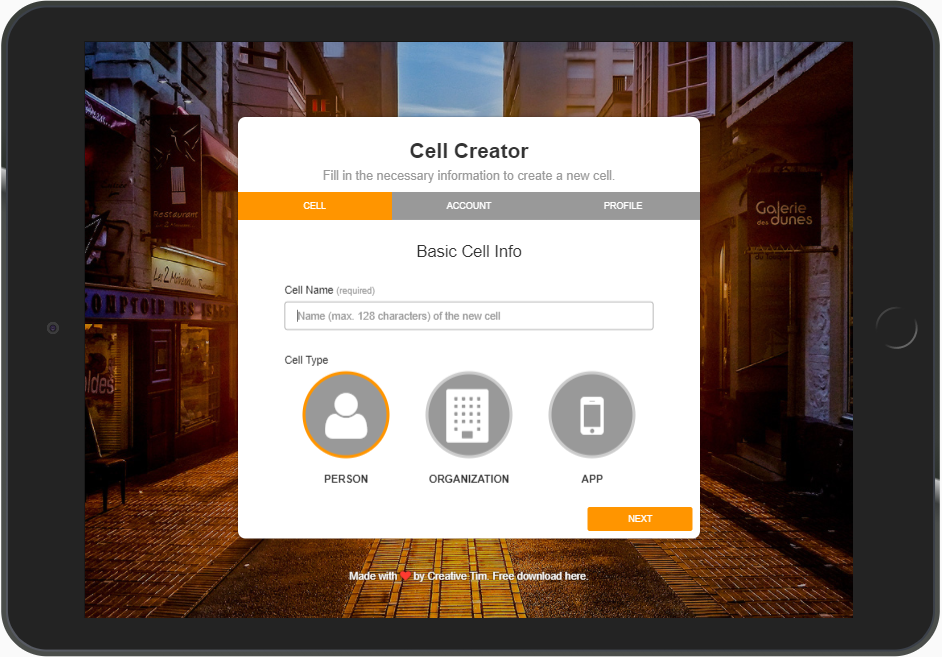
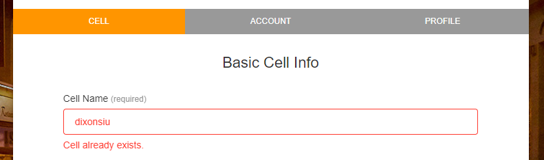
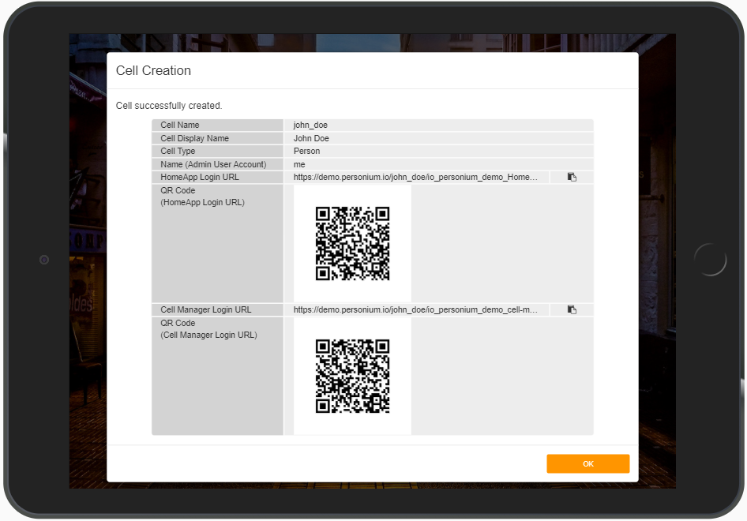

# Cell Creator Wizard  
A wizard that makes Personium cell creation as simple as crossing your fingers!  
Just fill in the blanks and a cell will be created with basic configurations.  

Watch the [demo (don't forget to turn on the caption) on youTube](https://www.youtube.com/watch?v=M4cYLFYRyEk&feature=youtu.be).  

# Top Page    
  

# Improved Usability  
1. Validation  
Besides checking for invalid value, an error is also displayed when the cell is already created so that you can pick another cell name.  
  

1. No typing     
If a PERSON cell is created, the followings are displayed for quick access to the HomeApp's login page.  
    - Copy to clipboard button  
    - QR Code  
  
